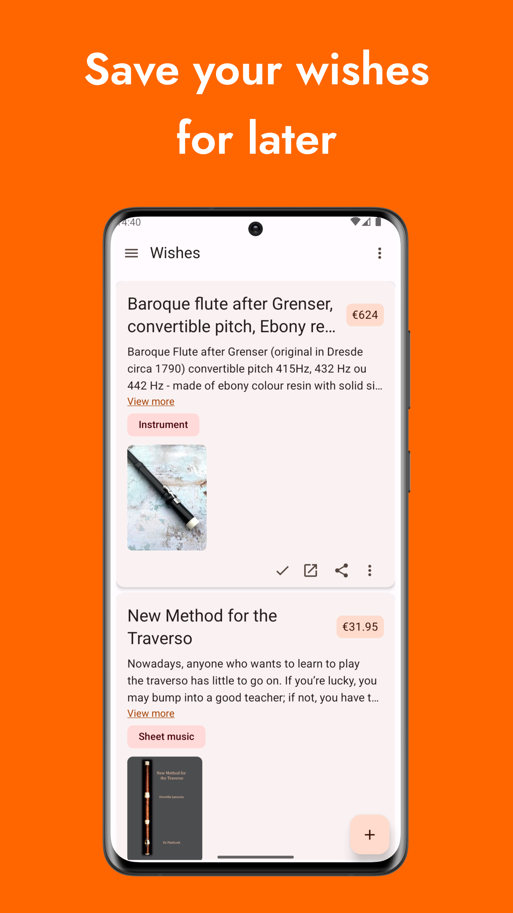
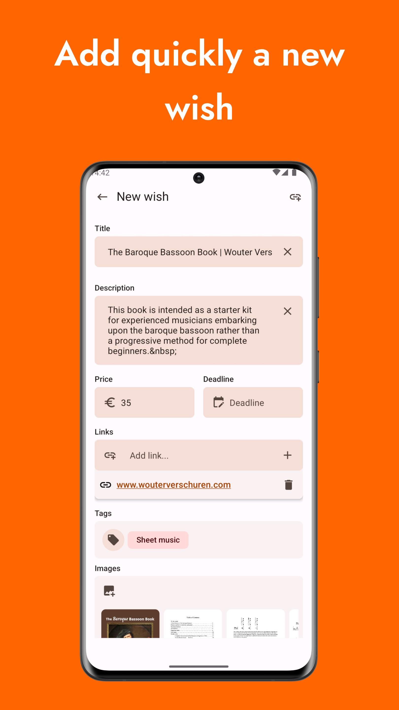
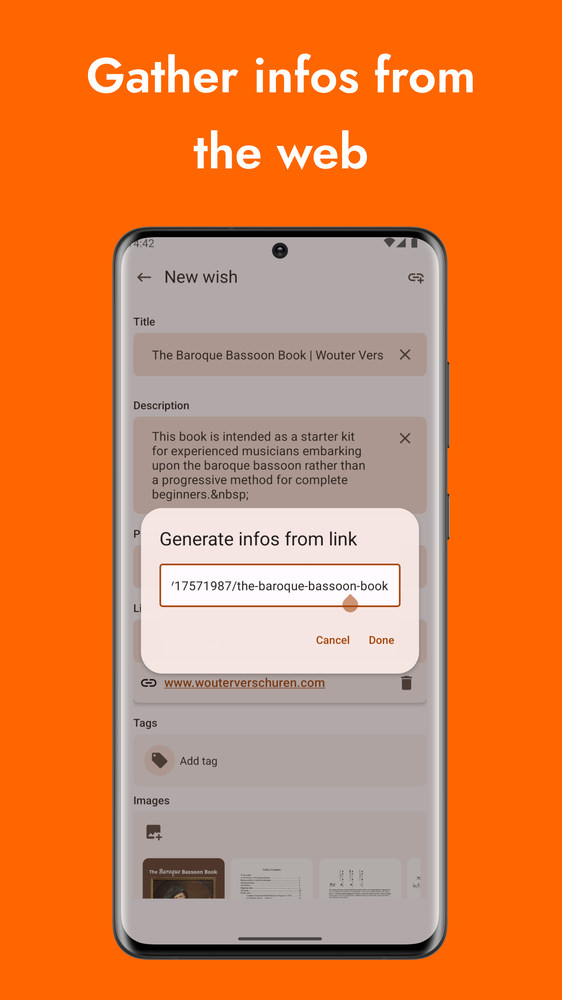
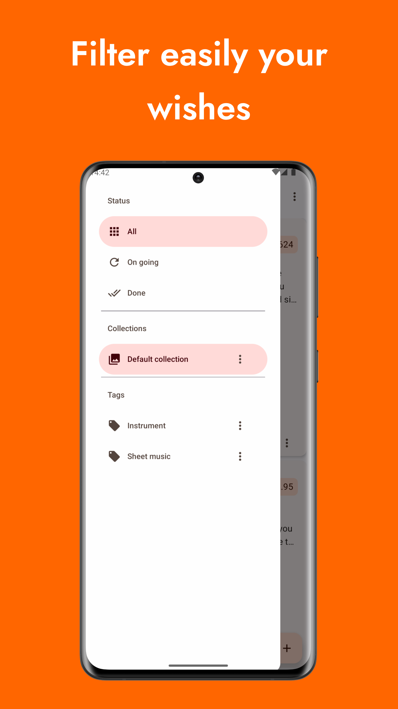

    

<h1 align="center"><b>ThereYouWish</b></h1>

<h4 align="center">Local wishlist mobile app. Gather all your wishes in a single place.</h4>

    

# Features

- Create your wish by adding title, description, price, deadline, tags, links and images
- Use collections and tags to order/filter them
- Extract content from the web to fill your wish (based on opengraph, twitter cards and json-ld/schema.org metadata)

The app is currently in a preview state and more is to come.

Upcoming features:

- Multiple entries linked to a single wish
- Be notified when a wish deadline is approaching
- Backup and restore
- Custom currency for a wish
- And more...

# Screenshots

  

# Credits

App icon made by [monkik](https://www.flaticon.com/free-icon/wish-list_776648) on [flaticon.com](https://www.flaticon.com).

# Licence

Project released under the GPLv3 licence.
